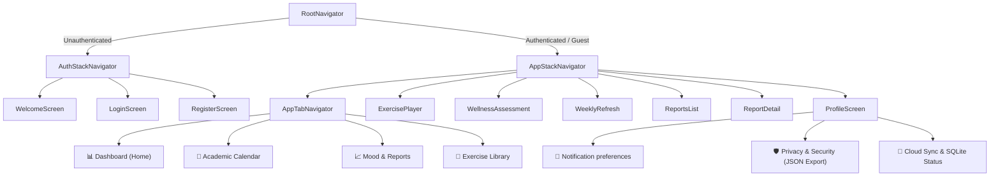
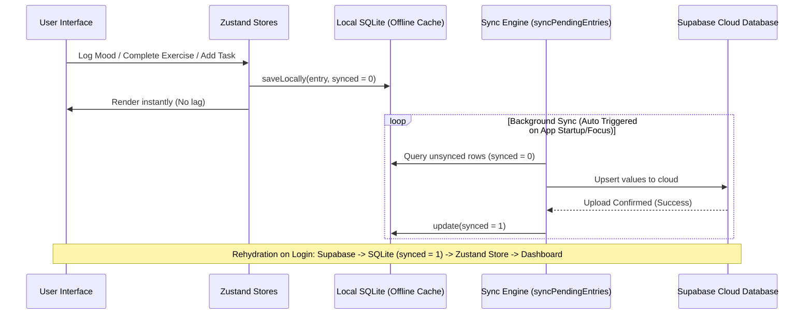

# 🧘 UniWell - Premium Student Wellness Sanctuary

> [!NOTE]
> **Academic Project Disclaimer**: This application was developed as part of a **Final Year Project** (FYP) for GIMPA. It is intended for academic and demonstration purposes and is not a commercial product.

**UniWell** is a state-of-the-art student wellness application designed to support university students through the high-pressure academic cycle. Built with a **"Liquid Glass"** aesthetic, it provides a serene, premium environment for mood tracking, stress management, academic flow planning, and personal analytics.

---

## 🛠 Application Flow & Navigation



---

## 📱 Detailed Feature Modules

### 1. Unified Time Range Filters (`[7 Days | 30 Days | All Time]`)
Every chart in the app automatically scales using a unified range selector:
* **Mood Line Chart**: Plots a calendar-week (Monday to Sunday) in the 7-day view (custom Ghana weekly layout), or rolling logs chronologically for the 30-day and All Time views.
* **Stress Heatmap**: Computes stress metrics mapping entries onto a 4-week grid representation.
* **Wellness Radar Chart**: Evaluates your score across the 8 dimensions of wellness (Physical, Emotional, Social, Intellectual, Occupational, Spiritual, Environmental, Financial) based on the selected range.

### 2. Mood & Wellness Tracker
* **Daily Check-in**: Track your daily mood (scale of 1-5) and stress levels (scale of 1-10) with optional personal reflection notes.
* **Check-in History Feed**: A scrollable history feed at the bottom of the Track tab displaying every past check-in (mood level, stress level, timestamp, and notes) sorted chronologically.
* **Tips Integration**: Integrates a library of wellness tips across `academic`, `sleep`, and `social` categories. Reading and marking them as read triggers checks and increments your dashboard achievements.

### 3. Streak-Based Wellness Reports
* **Reports Generator**: Weekly, Monthly, and Yearly reports are compiled.
* **Report Unlocking**: Reports are locked and will only unlock for viewing once the user achieves a **consecutive 7-day check-in streak** anywhere in their history (preventing premature lockouts).
* **Date-Bound Metrics**: Averages and dimension scores shown in reports are calculated strictly from the dates of that specific period, rather than reusing current dashboard averages.

### 4. Mindfulness & Micro-Habits Player
* **Micro-Habits Library**: 
  1. *Box Breathing* (Focus, 4 mins) - Visual scale-up and fade animations guiding user breath rhythms.
  2. *Neck & Shoulder Release* (Quick, 3 mins)
  3. *Deep Relaxation* (Relax, 10 mins)
  4. *5-4-3-2-1 Grounding* (Quick, 2 mins)
  5. *Eye Rest (20-20-20)* (Quick, 1 min)
  6. *Guided Gratitude* (Relax, 5 mins)
* **Tactile Completion alert**: Synchronous `Vibration.vibrate(...)` trigger fires immediately when the session ends, bypassing async chime audio latency.
* **Exercise History Log**: Displays completed sessions at the bottom of the Exercise tab with duration and timestamp.

### 5. GIMPA Academic Calendar & Custom Reminders
* **GIMPA Institutional Dates**: Pre-seeded with calendar milestones (mid-terms, registration periods, final exams).
* **Customizable Alerts**: Custom reminder tasks allow users to select alert notification offsets (`None`, `1 Hour Before`, `2 Hours Before`, `1 Day Before`, `2 Days Before`, `1 Week Before`).
* **Notification Cancellation**: Completing or deleting a task automatically queries its `notification_id` and cancels the OS scheduled notification.

### 6. Campus Support Directory
Direct dial and mail buttons to connect with campus security and wellness departments:
* **Emergency Crisis Hotline**: One-tap phone link to GIMPA Crisis Hotline (+233 302 401 681).
* **Campus Security**: One-tap phone link to GIMPA Campus Security (+233 302 401 682).
* **Counseling Services**: One-tap email scheduling hook (`counseling@gimpa.edu.gh`).
* **Campus Health**: Link to medical center resources.

### 7. Privacy Settings & Data Portability
Located under the Profile screen, this provides total transparency:
* **Diagnostics Toggle**: Disable anonymous telemetry sharing.
* **Download My Data**: Generates a unified JSON schema containing all local logs (moods, exercises, tasks, reports) and uses the native `Share` API to export it.
* **Wipe Device Cache**: Erases local SQLite tables cleanly while keeping cloud database storage intact.

---

## 🗄 Database Model & Schema Specifications

UniWell utilizes local SQLite caching (`wellness.db`) synced asynchronously with Supabase.

### 1. Mood Logs (`mood_logs` table)
* `id` (TEXT PRIMARY KEY) - Random unique string.
* `user_id` (TEXT) - Owner user ID or `'guest'`.
* `mood` (INTEGER) - Mood score (1 to 5).
* `stress` (INTEGER) - Stress level (1 to 10).
* `note` (TEXT) - Optional personal check-in note.
* `created_at` (TEXT) - ISO timestamp.
* `synced` (INTEGER) - `0` for unsynced, `1` for synced.

### 2. Completed Exercises (`completed_exercises` table)
* `id` (TEXT PRIMARY KEY)
* `user_id` (TEXT)
* `exercise_id` (TEXT) - Matching ID from exercises database.
* `exercise_title` (TEXT)
* `category` (TEXT)
* `duration_seconds` (INTEGER)
* `completed_at` (TEXT)
* `synced` (INTEGER)

### 3. Academic Tasks (`academic_tasks` table)
* `id` (TEXT PRIMARY KEY)
* `user_id` (TEXT)
* `title` (TEXT)
* `sub` (TEXT) - Optional task description.
* `tag` (TEXT) - `'ACADEMIC'` or `'PRIORITY'`.
* `date` (TEXT) - Task date (YYYY-MM-DD).
* `done` (INTEGER) - `1` if completed, `0` if active.
* `priority` (INTEGER)
* `synced` (INTEGER)
* `alert_trigger` (TEXT) - `'none'`, `'1h'`, `'2h'`, `'1d'`, `'2d'`, `'7d'`.
* `notification_id` (TEXT) - OS scheduled notification ID.

### 4. Dimension Ratings (`dimension_ratings` table)
* `id` (TEXT PRIMARY KEY)
* `user_id` (TEXT)
* `physical`, `emotional`, `social`, `intellectual`, `occupational`, `spiritual`, `environmental`, `financial` (INTEGER) - Dimension scores (0 to 100).
* `created_at` (TEXT)
* `synced` (INTEGER)

### 5. Reports (`reports` table)
* `id` (TEXT PRIMARY KEY)
* `user_id` (TEXT)
* `type` (TEXT) - `'weekly'`, `'monthly'`, or `'yearly'`.
* `date_label` (TEXT)
* `overall_score` (INTEGER)
* `summary` (TEXT)
* `content_json` (TEXT) - Detailed averages for that period.
* `created_at` (TEXT)
* `synced` (INTEGER)

---

## 🔄 SQLite & Supabase Sync Pipeline



---

## 🎨 Interface Visual Mockups

### 📊 Wellness Dashboard Screen
```text
+-------------------------------------------------------------+
|  💡 Welcome Back, Student!                      [Profile]   |
|  "Your wellness index is looking strong today."             |
+-------------------------------------------------------------+
|  📊 WELLNESS INDEX                                          |
|  [====================== 84 / 100 ========================] |
|  Streak: 7 days 🔥   Completed: 14 exercises 🧘   Tips: 5 ✓  |
+-------------------------------------------------------------+
|  🧭 WELLNESS RADAR CHART                 [ 7D | 30D | All ] |
|                                                             |
|                    (Physical: 80)                           |
|                  /                \                         |
|         (Emotional: 70)          (Financial: 60)            |
|                |                        |                   |
|         (Social: 90)             (Intellectual: 80)         |
|                  \                /                         |
|                   (Spiritual: 75)                           |
|                                                             |
+-------------------------------------------------------------+
|  📅 UPCOMING SCHEDULE                                       |
|  🔴 Exam: Chemistry Mid-Term - Tomorrow at 9:00 AM          |
|  💗 Personal: Review chapter 3 notes (2 hrs before alert)   |
+-------------------------------------------------------------+
```

### 📈 Mood Tracker & Reports Screen
```text
+-------------------------------------------------------------+
|  Track & Report                                             |
+-------------------------------------------------------------+
|  📈 MOOD HISTORY CHART                   [ 7D | 30D | All ] |
|  5 |     *                                                  |
|  4 |   /   \                                                |
|  3 |  *     *                                               |
|  2 |          \                                             |
|  1 |            *                                           |
|    +-----------------------------------------------------+  |
|       Mon  Tue  Wed  Thu  Fri  Sat  Sun                     |
+-------------------------------------------------------------+
|  🧘 DAILY CHECK-IN                                          |
|  Log how you are feeling to unlock your weekly report!      |
|  [ Log Mood & Stress ]                                      |
+-------------------------------------------------------------+
|  📄 WELLNESS REPORTS ARCHIVE                                |
|  🔒 Weekly Report #4 (Locked - Complete 7-Day Streak)       |
|  ✓  Weekly Report #3 (Unlocked - 82% Overall Wellness)       |
+-------------------------------------------------------------+
|  📜 PAST CHECK-INS FEED                                     |
|  - Wednesday, May 27: Mood 4/5, Stress 3/10                 |
|    "Feeling focused, prepared for tomorrow's exam."         |
+-------------------------------------------------------------+
```

### 📅 Academic Calendar Screen
```text
+-------------------------------------------------------------+
|  Academic Flow                            [ + Add Reminder ]|
+-------------------------------------------------------------+
|  < May 2026 >                                               |
|  Mon   Tue   Wed   Thu   Fri   Sat   Sun                    |
|   25    26   [27]   28    29    30    31                    |
|   (•)   (•)   (•)  ( )   ( )   ( )   ( )                    |
|   Pink  Teal  Red                                           |
+-------------------------------------------------------------+
|  LEGEND                                                     |
|  🔴 Exam   🟡 Deadline   🟢 Holiday   🔵 Event   💗 Personal|
+-------------------------------------------------------------+
|  📅 SELECTED DATE: MAY 27, 2026                             |
|  🔴 Exam: Chemistry Mid-Term (GIMPA Preloaded Event)        |
|     - Time: 9:00 AM                                         |
|     - Reminder: Scheduled 1 week & 1 day before             |
|                                                             |
|  💗 Personal: Prepare lab notes                             |
|     - Alert: 2 Hours Before (7:00 AM)                       |
+-------------------------------------------------------------+
```

---

## 🚀 Getting Started

### Installation
1. **Clone the repository:**
   ```bash
   git clone https://github.com/eddiee-jnr/UniWell.git
   cd UniWell
   ```
2. **Install dependencies:**
   ```bash
   npm install
   ```
3. **Configure Environment Variables:**
   Create a `.env` file in the root folder:
   ```env
   EXPO_PUBLIC_SUPABASE_URL=your_supabase_url
   EXPO_PUBLIC_SUPABASE_ANON_KEY=your_supabase_anon_key
   ```

### Running Locally
* **Standard Online Mode**:
  ```bash
  npx expo start
  ```
* **Offline Bundling Mode** (bypasses Expo CLI network validation checks when connected to mobile hotspots or low-bandwidth connections):
  ```bash
  npx expo start --offline
  ```

---
Developed with ❤️ for students who strive for balance.
