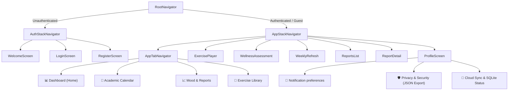
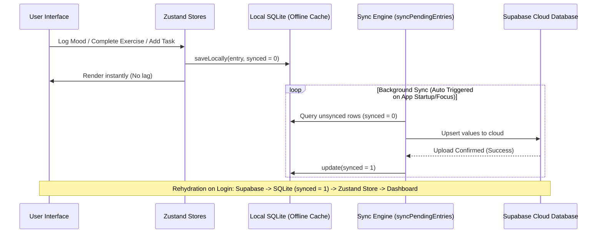

# 🧘 UniWell - Premium Student Wellness Sanctuary

> [!NOTE]
> **Academic Project Disclaimer**: This application was developed as part of a **Final Year Project** (FYP) for GIMPA. It is intended for academic and demonstration purposes and is not a commercial product.

**UniWell** is a state-of-the-art student wellness application designed to support university students through the high-pressure academic cycle. Built with a **"Liquid Glass"** aesthetic, it provides a serene, premium environment for mood tracking, stress management, academic flow planning, and personal analytics.

---

## 🛠 Application Navigation & Flow



---

## 📱 Core Feature Modules

### 1. Unified Time Range Filters (`[7 Days | 30 Days | All Time]`)
Every chart in the app automatically scales using a unified range picker at the top:
* **Mood Line Chart**: Plots a calendar-week (Monday to Sunday) in the 7-day view, or rolling logs chronologically for the 30-day and All Time views.
* **Stress Heatmap**: Computes stress metrics mapping entries onto a 4-week grid representation.
* **Wellness Radar Chart**: Evaluates your score across the 8 dimensions of wellness (Physical, Emotional, Social, Intellectual, Occupational, Spiritual, Environmental, Financial) based on the selected range.

### 2. SQLite & Supabase Sync Pipeline
UniWell utilizes a hybrid data layer to ensure it works 100% offline while syncing to the cloud when connected.



### 3. Customizable Reminders & Alerts
Personal reminders and tasks in the calendar don't just use fixed notifications. You can configure individual triggers for custom tasks:
* **Options**: `None`, `1 Hour Before`, `2 Hours Before`, `1 Day Before`, `2 Days Before`, `1 Week Before`.
* **Auto-Cancellation**: Marking a task as done or deleting it query its registered `notification_id` and cancel the OS scheduled notification immediately to avoid orphaned alerts.

### 4. Privacy Settings & Data Portability
Located under the Profile screen, this provides total transparency:
* **Diagnostics Toggle**: Disable anonymous telemetry sharing.
* **Download My Data**: Generates a unified JSON schema containing all local logs (moods, exercises, tasks, reports) and uses the native `Share` API to export/export it.
* **Wipe Device Cache**: Erases local SQLite tables cleanly while keeping cloud database storage intact.

---

## 🎨 Visual Wireframe Representation

### 📊 Wellness Dashboard Screen
```text
+-------------------------------------------------------------+
|  💡 Welcome Back, Student!                      [Profile]   |
|  "Your wellness index is looking strong today."             |
+-------------------------------------------------------------+
|  📊 WELLNESS INDEX                                          |
|  [====================== 84 / 100 ========================] |
|  Streak: 7 days 🔥   Completed: 14 exercises 🧘   Tips: 5 ✓  |
+-------------------------------------------------------------+
|  🧭 WELLNESS RADAR CHART                 [ 7D | 30D | All ] |
|                                                             |
|                    (Physical: 80)                           |
|                  /                \                         |
|         (Emotional: 70)          (Financial: 60)            |
|                |                        |                   |
|         (Social: 90)             (Intellectual: 80)         |
|                  \                /                         |
|                   (Spiritual: 75)                           |
|                                                             |
+-------------------------------------------------------------+
|  📅 UPCOMING SCHEDULE                                       |
|  🔴 Exam: Chemistry Mid-Term - Tomorrow at 9:00 AM          |
|  💗 Personal: Review chapter 3 notes (2 hrs before alert)   |
+-------------------------------------------------------------+
```

### 📈 Mood Tracker & Reports Screen
```text
+-------------------------------------------------------------+
|  Track & Report                                             |
+-------------------------------------------------------------+
|  📈 MOOD HISTORY CHART                   [ 7D | 30D | All ] |
|  5 |     *                                                  |
|  4 |   /   \                                                |
|  3 |  *     *                                               |
|  2 |          \                                             |
|  1 |            *                                           |
|    +-----------------------------------------------------+  |
|       Mon  Tue  Wed  Thu  Fri  Sat  Sun                     |
+-------------------------------------------------------------+
|  🧘 DAILY CHECK-IN                                          |
|  Log how you are feeling to unlock your weekly report!      |
|  [ Log Mood & Stress ]                                      |
+-------------------------------------------------------------+
|  📄 WELLNESS REPORTS ARCHIVE                                |
|  🔒 Weekly Report #4 (Locked - Complete 7-Day Streak)       |
|  ✓  Weekly Report #3 (Unlocked - 82% Overall Wellness)       |
+-------------------------------------------------------------+
|  📜 PAST CHECK-INS FEED                                     |
|  - Wednesday, May 27: Mood 4/5, Stress 3/10                 |
|    "Feeling focused, prepared for tomorrow's exam."         |
+-------------------------------------------------------------+
```

### 📅 Academic Calendar Screen
```text
+-------------------------------------------------------------+
|  Academic Flow                            [ + Add Reminder ]|
+-------------------------------------------------------------+
|  < May 2026 >                                               |
|  Mon   Tue   Wed   Thu   Fri   Sat   Sun                    |
|   25    26   [27]   28    29    30    31                    |
|   (•)   (•)   (•)  ( )   ( )   ( )   ( )                    |
|   Pink  Teal  Red                                           |
+-------------------------------------------------------------+
|  LEGEND                                                     |
|  🔴 Exam   🟡 Deadline   🟢 Holiday   🔵 Event   💗 Personal|
+-------------------------------------------------------------+
|  📅 SELECTED DATE: MAY 27, 2026                             |
|  🔴 Exam: Chemistry Mid-Term (GIMPA Preloaded Event)        |
|     - Time: 9:00 AM                                         |
|     - Reminder: Scheduled 1 week & 1 day before             |
|                                                             |
|  💗 Personal: Prepare lab notes                             |
|     - Alert: 2 Hours Before (7:00 AM)                       |
+-------------------------------------------------------------+
```

---

## 🛠 Tech Stack & Dependencies

* **Frontend Framework**: React Native (Expo SDK 54)
* **Design Engine**: Specular Liquid Glass Custom Theme System (Vanilla CSS + native StyleSheets)
* **Local Caching Layer**: `expo-sqlite` (wellness.db)
* **State Management**: `zustand` (Zustand stores auto-refreshing from SQLite)
* **Notification System**: `expo-notifications` (daily triggers, relative custom alerts)
* **Audio & Hardware Alerts**: `expo-av` (completion chimes) & `react-native` vibration loops
* **Cloud Database & Auth**: Supabase JS Client (`supabase-js` authentication & synchronization)

---

## 🚀 Getting Started

### Installation
1. **Clone the repository:**
   ```bash
   git clone https://github.com/eddiee-jnr/UniWell.git
   cd UniWell
   ```
2. **Install dependencies:**
   ```bash
   npm install
   ```
3. **Configure Environment Variables:**
   Create a `.env` file in the root folder:
   ```env
   EXPO_PUBLIC_SUPABASE_URL=your_supabase_url
   EXPO_PUBLIC_SUPABASE_ANON_KEY=your_supabase_anon_key
   ```

### Running Locally
* **Standard Online Mode**:
  ```bash
  npx expo start
  ```
* **Offline Bundling Mode** (bypasses Expo CLI network validation checks when connected to capture hotspots or low-bandwidth connections):
  ```bash
  npx expo start --offline
  ```

---
Developed with ❤️ for students who strive for balance.
