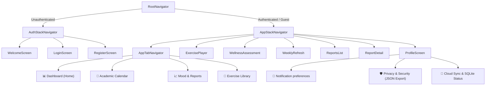
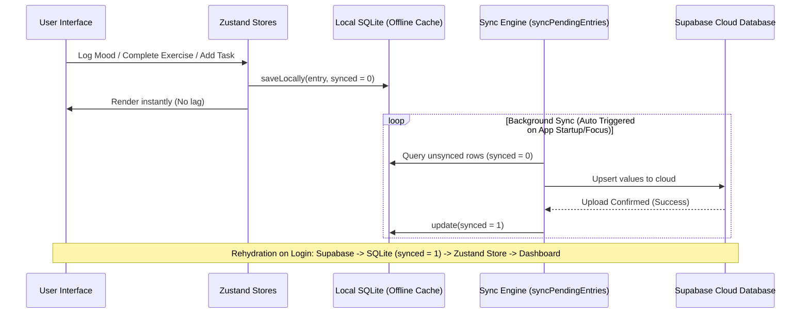

# 🧘 UniWell - Premium Student Wellness Sanctuary

> [!NOTE]
> **Academic Project Disclaimer**: This application was developed as part of a **Final Year Project** (FYP) for GIMPA. It is intended for academic and demonstration purposes and is not a commercial product.

**UniWell** is a state-of-the-art student wellness application designed to support university students through the high-pressure academic cycle. Built with a **"Liquid Glass"** aesthetic, it provides a serene, premium environment for mood tracking, stress management, academic flow planning, and personal analytics.

---

## 🛠 Application Flow & Navigation



---

## 📱 Detailed Feature Modules

### 1. Unified Time Range Filters (`[7 Days | 30 Days | All Time]`)
Every chart in the app automatically scales using a unified range selector:
* **Mood Line Chart**: Plots a calendar-week (Monday to Sunday) in the 7-day view (custom Ghana weekly layout), or rolling logs chronologically for the 30-day and All Time views.
* **Stress Heatmap**: Computes stress metrics mapping entries onto a 4-week grid representation.
* **Wellness Radar Chart**: Evaluates your score across the 8 dimensions of wellness (Physical, Emotional, Social, Intellectual, Occupational, Spiritual, Environmental, Financial) based on the selected range.

### 2. Mood & Wellness Tracker
* **Daily Check-in**: Track your daily mood (scale of 1-5) and stress levels (scale of 1-10) with optional personal reflection notes.
* **Check-in History Feed**: A scrollable history feed at the bottom of the Track tab displaying every past check-in (mood level, stress level, timestamp, and notes) sorted chronologically.
* **Tips Integration**: Integrates a curated library of wellness tips across three specific categories. Reading and marking them as read increments your dashboard achievements:
  1. **Academic**: Focuses on cognitive science study techniques, including the *Pomodoro Technique*, *Active Recall*, note review triggers, planning strategies, and creating dedicated study spaces.
  2. **Sleep**: Focuses on sleep hygiene tips, such as screen avoidance before bed, room temperature cooling, caffeine half-life limitations, and doing a nighttime "brain dump" to reduce racing thoughts.
  3. **Social**: Focuses on managing social anxiety, scheduling connection times, active presence (putting screens away during conversations), and joining campus societies.

### 3. Streak-Based Wellness Reports
* **Reports Generator**: Weekly, Monthly, and Yearly reports are compiled.
* **Report Unlocking**: Reports are locked and will only unlock for viewing once the user achieves a **consecutive 7-day check-in streak** anywhere in their history (preventing premature lockouts).
* **Date-Bound Metrics**: Averages and dimension scores shown in reports are calculated strictly from the dates of that specific period, rather than reusing current dashboard averages.

### 4. Mindfulness & Micro-Habits Player
* **Micro-Habits Library**: 
  1. *Box Breathing* (Focus, 4 mins) - Visual scale-up and fade animations guiding user breath rhythms.
  2. *Neck & Shoulder Release* (Quick, 3 mins)
  3. *Deep Relaxation* (Relax, 10 mins)
  4. *5-4-3-2-1 Grounding* (Quick, 2 mins)
  5. *Eye Rest (20-20-20)* (Quick, 1 min)
  6. *Guided Gratitude* (Relax, 5 mins)
* **Tactile Completion alert**: Synchronous `Vibration.vibrate(...)` trigger fires immediately when the session ends, bypassing async chime audio latency.
* **Exercise History Log**: Displays completed sessions at the bottom of the Exercise tab with duration and timestamp.

### 5. GIMPA Academic Calendar & Custom Reminders
* **GIMPA Institutional Dates**: Pre-seeded with calendar milestones (mid-terms, registration periods, final exams).
* **Customizable Alerts**: Custom reminder tasks allow users to select alert notification offsets (`None`, `1 Hour Before`, `2 Hours Before`, `1 Day Before`, `2 Days Before`, `1 Week Before`).
* **Notification Cancellation**: Completing or deleting a task automatically queries its `notification_id` and cancels the OS scheduled notification.

### 6. Campus Support Directory
Direct dial and mail buttons to connect with campus security and wellness departments:
* **Emergency Crisis Hotline**: One-tap phone link to GIMPA Crisis Hotline (+233 302 401 681).
* **Campus Security**: One-tap phone link to GIMPA Campus Security (+233 302 401 682).
* **Counseling Services**: One-tap email scheduling hook (`counseling@gimpa.edu.gh`).
* **Campus Health**: Link to medical center resources.

---

## 🔒 Institutional GIMPA Integration & Security

To maintain academic and institutional credibility, UniWell implements strict registration controls and pre-loaded student support systems:

### 1. GIMPA Email Domain Verification
* **Closed Registration Loop**: Registration is restricted exclusively to students using their official university email addresses. The signup page runs a strict domain check on the input string:
  ```typescript
  if (!email.toLowerCase().endsWith('@st.gimpa.edu.gh')) {
    // Blocks registration and displays institutional warning alert
  }
  ```
* **Milestone Calendar Seeding**: If the authenticated user belongs to GIMPA (validated through a `@st.gimpa.edu.gh` or `@gimpa.edu.gh` suffix), the system triggers an automatic calendar seeder. It pre-populates local SQLite with key academic milestones (commencement dates, undergraduate registration periods, mid-sem exams, late registration penalty deadlines, revision periods, and end-of-semester final examinations) to keep students organized.

### 2. Ghana Public Holidays
The pre-seeded academic database automatically integrates and displays official **Ghana Public Holidays** for the 2026 cycle. These dates appear with a distinct green (`#10B981`) legend identifier on the calendar and include descriptions explaining their historical context:

| Holiday | Date | Description |
| :--- | :--- | :--- |
| **New Year's Day** | January 1, 2026 | National public holiday celebrating the start of the year. |
| **Constitution Day** | January 7, 2026 | Marks the adoption of the 1992 Fourth Republic Constitution. |
| **Independence Day** | March 6, 2026 | Commemorates Ghana's independence from British colonial rule. |
| **Eid al-Fitr** | March 20, 2026 | Islamic public holiday marking the end of Ramadan. |
| **Good Friday** | April 3, 2026 | Christian holiday commemorating the crucifixion of Jesus Christ. |
| **Holy Saturday** | April 4, 2026 | Commemorates the day Jesus lay in the tomb. |
| **Easter Monday** | April 6, 2026 | Christian holiday celebrating the resurrection of Jesus. |
| **May Day** | May 1, 2026 | National holiday celebrating worker achievements and labor rights. |
| **Africa Unity Day** | May 25, 2026 | Celebrates the founding of the Organisation of African Unity. |
| **Eid al-Adha** | May 27, 2026 | Islamic holiday honoring Abraham's willingness to sacrifice his son. |
| **Founders' Day** | August 4, 2026 | Honors the pioneers who led Ghana to independence. |
| **Kwame Nkrumah Memorial** | September 21, 2026 | Birthday of Dr. Kwame Nkrumah, Ghana's first President. |
| **Farmers' Day** | December 4, 2026 | Honors agricultural workers for their vital economic contributions. |
| **Christmas Day** | December 25, 2026 | Celebrates the birth of Jesus Christ. |
| **Boxing Day** | December 26, 2026 | Holiday celebrated the day after Christmas. |

---

## 👥 Guest Mode (Limited Access Mode)

UniWell offers a fully-functional, offline-first **Guest Mode** for immediate onboarding without registration. Guest Mode restricts specific features to encourage full signup while maintaining a premium experience:

* **Session Cache Wipes**: Entering Guest Mode executes `clearAllLocalData()`, erasing any cached `mood_logs`, `completed_exercises`, and `academic_tasks` to ensure a completely clean slate.
* **Exit Warning**: Since guest data is not backed up to Supabase, logging out or exiting guest mode displays a warning Alert: *"Anything you've tracked this session won't be saved. Create a free account to keep your progress."*
* **Removed Calendar Tab**: The "Calendar" tab is completely removed from the bottom tab bar.
* **Stat Card Replacement**: The "DAY STREAK" card is hidden on the Dashboard screen, leaving only "EXERCISES" and "READ TIPS" visible.
* **Simplified Exercises**: The completed sessions history feed is hidden on the Exercise library screen.
* **Coming Soon Chatbot FAB**: A floating action button with a robot icon appears on the Dashboard screen for guests. Tapping it shows a notice about the upcoming AI wellness companion.
* **Support Directory Filter**: In Guest Mode, the "Visit Clinic" link (directing to GIMPA web resources) is filtered out and hidden to limit external access.

---

## 📊 Monthly & Yearly Reports & Detail Layouts

Beyond the weekly archives, UniWell compiles long-term reports to track trends over semesters:

* **Access Path**: Users navigate to these reports on the Profile page under the **Wellness Reports** section.
* **Tabbed Interface**: A structured tab header enables immediate switching between **Weekly**, **Monthly**, and **Yearly** generated reports.
* **Lock State Alert**: If accessed in Guest Mode, a signup block page explains that an account is required to generate long-term analytics.
* **Report Details Layout**: Tapping any report opens a full dashboard report detail page:
  * **Radar Chart Snapshot**: Renders a dynamic radar chart evaluating balance across the 8 dimensions specifically calculated for that period.
  * **Core Metrics Summary**: Displays calculated average mood, stress level, strongest dimension, and target focus area.
  * **Written Analysis**: A plain-language summary of the user's mental workload.
  * **Dynamic Recommendations**: Custom advice based on stress averages and lowest-scoring dimensions (e.g., suggesting breathing exercises or contacting campus support).

---

## 📝 Plain Language Interpretations (Track & Report)

To make health data actionable, UniWell translates raw numbers into textual interpretations:

### 1. Overall Wellness Score
* **High (>= 66%)**: *"Overall you are in a strong wellness position right now. Keep building on what is working."*
* **Moderate (41-65%)**: *"Your overall wellness is moderate. There are clear areas of strength and a few that need attention — your full report below will show you where to focus."*
* **Low (<= 40%)**: *"Your overall wellness score is low this period. Please do not ignore this. Small consistent actions can shift this significantly — and support is available on your Support page."*

### 2. Mood Average
* **High (>= 4)**: *"Your mood has been mostly positive this week. You appear to be managing your emotional load well."*
* **Moderate (2-3)**: *"Your mood has been variable this week. Some days were harder than others — this is completely normal under academic pressure."*
* **Low (< 2)**: *"Your mood has been consistently low this week. This is worth paying attention to. We strongly encourage you to visit the campus support directory or speak to someone you trust."*

### 3. Stress Average
* **High (>= 7)**: *"Your stress peaked recently. This may have coincided with academic deadlines or exams. Recognising your stress patterns helps you prepare better next time."*
* **Low (< 7)**: *"Your stress has been well-managed recently. Keep maintaining the habits that are working for you."*

### 4. Swarbrick's 8 Dimensions of Wellness
Each dimension displays its description and translates its calculated score (Low <= 40%, Moderate 41-65%, High >= 66%) into targeted advice:

* **Physical**: Recognising the need for and engaging in physical activity, eating nourishing foods, and getting adequate sleep and rest.
  * *Low (<= 40%)*: *"Your physical wellness is lower than ideal. This suggests foundational habits around sleep or activity are slipping. Try adding one short walk or stretch to your daily routine this week."*
  * *Moderate (41-65%)*: *"You are about halfway on your physical wellness. This suggests some healthy habits are in place but there is room to improve — particularly around sleep or physical activity. Try completing one physical exercise this week."*
  * *High (>= 66%)*: *"Your physical wellness is strong. You are maintaining excellent foundational habits which support your academic resilience."*
* **Emotional**: Developing skills and strategies to cope with stress. Being able to express feelings effectively.
  * *Low (<= 40%)*: *"Your emotional wellness is low. You may be feeling overwhelmed or unable to process recent stressors. Please be gentle with yourself and consider speaking to a campus counselor."*
  * *Moderate (41-65%)*: *"Your emotional wellness is moderate. You are coping, but the pressure might be building. A short breathing exercise today could help reset your focus."*
  * *High (>= 66%)*: *"Your emotional wellness is strong. You are demonstrating excellent emotional regulation and coping strategies."*
* **Social**: Developing a sense of connection, belonging, and a well-developed support system.
  * *Low (<= 40%)*: *"Your social wellness is very low. Academic pressure can often lead to isolation. Try reaching out to just one friend or family member today."*
  * *Moderate (41-65%)*: *"Your social wellness is moderate. You have some support, but could benefit from deeper connections. Consider joining a campus club or study group."*
  * *High (>= 66%)*: *"Your social wellness is a key strength. You have a solid support system that acts as a buffer against academic stress."*
* **Intellectual**: Recognising creative abilities and finding ways to expand knowledge and skills.
  * *Low (<= 40%)*: *"Your intellectual wellness is lower than ideal. This could mean you are feeling understimulated or overwhelmed by coursework rather than genuinely engaged. Try exploring one topic this week purely out of curiosity."*
  * *Moderate (41-65%)*: *"Your intellectual wellness is moderate. You are keeping up with academic demands, but may lack creative stimulation. Try learning something completely unrelated to your degree today."*
  * *High (>= 66%)*: *"Your intellectual wellness is strong. You are genuinely engaging with your academic journey and finding mental stimulation rewarding."*
* **Occupational**: Personal satisfaction and enrichment from one's work, including academic pursuits and career planning.
  * *Low (<= 40%)*: *"Your occupational wellness is low. You may be feeling disconnected from your academic goals or worried about your career path."*
  * *Moderate (41-65%)*: *"Your occupational wellness is moderate. You are making steady progress but might benefit from clearer short-term goals. Check off one small academic task today."*
  * *High (>= 66%)*: *"Your occupational wellness is strong. You feel purposeful and satisfied with your academic and career trajectory."*
* **Spiritual**: Developing a sense of meaning, purpose, balance, and peace in your life.
  * *Low (<= 40%)*: *"Your spiritual wellness is low. You may be feeling a lack of purpose or disconnect from your values. Taking 10 minutes to journal might help ground you."*
  * *Moderate (41-65%)*: *"Your spiritual wellness is moderate. You have some sense of balance but it might be wavering under pressure. Try spending a few moments in quiet reflection."*
  * *High (>= 66%)*: *"Your spiritual wellness is strong. You have a deep sense of meaning and purpose that guides you through difficulties."*
* **Environmental**: Good health by occupying pleasant, stimulating environments that support well-being.
  * *Low (<= 40%)*: *"Your environmental wellness is low. A cluttered or unsafe space can amplify stress. Try organizing your immediate study study desk for 5 minutes."*
  * *Moderate (41-65%)*: *"Your environmental wellness is moderate. Your spaces are functional but perhaps not deeply comforting. Adding some natural light or plants might help."*
  * *High (>= 66%)*: *"Your environmental wellness is excellent. Your living and study environments actively support your peace of mind."*
* **Financial**: Satisfaction with current and future financial situations.
  * *Low (<= 40%)*: *"Your financial wellness is low. Financial stress is a major burden. We recommend visiting the campus financial aid office for guidance and support options."*
  * *Moderate (41-65%)*: *"Your financial wellness is moderate. You are managing, but may feel tight. Budgeting a small weekly allowance for treats could help you feel more in control."*
  * *High (>= 66%)*: *"Your financial wellness is strong. You appear to feel in control of your current situation, which removes a significant source of student stress."*

---

## 📅 Sunday Refresh (Weekly Refresh Screen)

On Sundays, if the user has a recorded baseline assessment, a dedicated **Sunday Refresh** card appears on their Dashboard:

* **Purpose**: Prompts the user to update their Tier 2 dimensions (Spiritual, Environmental, Financial) which are less volatile than Tier 1 dimensions (Physical, Emotional, Social, Intellectual, Occupational).
* **Questionnaire**: Guides the user through three simple questions:
  1. *Spiritual*: *"How much sense of meaning or purpose do you feel in your life right now?"*
  2. *Environmental*: *"How safe, comfortable, and supportive do you find your living and study spaces?"*
  3. *Financial*: *"How much in control of your financial situation do you feel currently?"*
* **Radar Update**: Preserves existing Tier 1 scores in SQLite while inserting a new dimension rating set with updated Tier 2 scores, refreshing the radar chart.

---

## 🛡️ Privacy, Telemetry & GDPR Compliance

UniWell incorporates robust privacy management tools on the Privacy screen to give students full control over their personal data:

* **Diagnostics Telemetry Toggle**: Allows users to enable or disable anonymous usage diagnostics telemetry sharing.
* **Data Portability**: The **"Download My Data"** button compiles all local tables (check-ins, exercise logs, tasks, reports) into a standardized JSON payload and calls the native `Share` API to export it.
* **Wipe Device Cache**: Erases local SQLite tables cleanly while keeping cloud database storage intact.
* **GDPR Account Deletion Request**: Students can permanently delete their accounts. Tapping this triggers a deletion request, notifies the user that cloud credentials will be purged within 48 hours, and automatically signs the user out.

---

## 🔄 SQLite & Supabase Sync Pipeline



### 1. Rehydration Pipeline (Supabase ➔ SQLite)
Upon login (or when restoring an existing session), the app runs `rehydrateUserData(userId)` in `syncService.ts`:
1. **Parallel Execution**: Fetches mood entries, wellness dimensions, completed exercises, and academic tasks in parallel using `Promise.allSettled` to maximize loading speeds.
2. **Duplication Protection**: Checks the local SQLite table IDs. If a record from Supabase is not present in SQLite, it is inserted locally with `synced = 1` so it is marked as synced.
3. **Zustand Refresh**: Loads the newly restored SQLite data into memory (`useMoodStore.loadEntries()` and `useAcademicStore.loadTasks()`).
4. **Tips Restoration**: Restores read tip engagements into `tipsStore` to align dashboard counters.
5. **Notification Setup**: Checks notification permissions. If granted, it schedules the user's preferred daily check-in reminder and any academic deadline events.
6. **State Unlock**: Clears the `isRehydrating` store flag, moving the user from the loading screen to the active dashboard.

### 2. Live Sync Status & Offloading Queue
Students can monitor connection and queue details in the **Data Integration** settings sub-screen:
* **Visual Status Badges**: Displays a green dot **"Connected"** badge when authenticated and linked to Supabase, or an orange **"Offline / Guest"** badge when offline or in Guest Mode.
* **Five-Queue Sync Counts**: Displays individual counts of pending uploads in SQLite for:
  1. *Mood & Stress Logs*
  2. *Completed Exercises*
  3. *Academic Tasks & Events*
  4. *Dimension Self-Assessments*
  5. *Generated Wellness Reports*
* **Manual Sync Control**: Provides a manual "Sync Now" button that triggers the upload loop, updating SQLite records to `synced = 1`.

---

## 🔔 Account Notification Preferences Panel

Located under Profile Settings ➔ **Notifications**, the application hosts a unified panel managing user alerts. It updates the user's Supabase auth metadata and updates local OS notification schedules:

* **Daily Wellness Check-in Toggle**: Enable/disable daily reminders, complete with a custom time picker (dropdown selectors for hours).
* **Exams & Deadlines Toggle**: Toggle to receive notifications 7 days and 1 day before preloaded academic calendar events.
* **Weekly Report Alerts**: Get notified when weekly wellness summary reports are compiled.
* **Monthly Report Alerts**: Get notified when monthly analytics reports are ready.
* **Exam Countdown Nudges**: Receive stress-management nudges when exam events are 3 days away.

---

## 🗄 Database Model & Schema Specifications

UniWell utilizes local SQLite caching (`wellness.db`) synced asynchronously with Supabase.

### 1. Mood Logs (`mood_logs` table)
* `id` (TEXT PRIMARY KEY) - Random unique string.
* `user_id` (TEXT) - Owner user ID or `'guest'`.
* `mood` (INTEGER) - Mood score (1 to 5).
* `stress` (INTEGER) - Stress level (1 to 10).
* `note` (TEXT) - Optional personal check-in note.
* `created_at` (TEXT) - ISO timestamp.
* `synced` (INTEGER) - `0` for unsynced, `1` for synced.

### 2. Completed Exercises (`completed_exercises` table)
* `id` (TEXT PRIMARY KEY)
* `user_id` (TEXT)
* `exercise_id` (TEXT) - Matching ID from exercises database.
* `exercise_title` (TEXT)
* `category` (TEXT)
* `duration_seconds` (INTEGER)
* `completed_at` (TEXT)
* `synced` (INTEGER)

### 3. Academic Tasks (`academic_tasks` table)
* `id` (TEXT PRIMARY KEY)
* `user_id` (TEXT)
* `title` (TEXT) - Task title.
* `sub` (TEXT) - Optional task description.
* `tag` (TEXT) - `'ACADEMIC'` or `'PRIORITY'`.
* `date` (TEXT) - Task date (YYYY-MM-DD).
* `done` (INTEGER) - `1` if completed, `0` if active.
* `priority` (INTEGER)
* `synced` (INTEGER)
* `alert_trigger` (TEXT) - `'none'`, `'1h'`, `'2h'`, `'1d'`, `'2d'`, `'7d'`.
* `notification_id` (TEXT) - OS scheduled notification ID.

### 4. Dimension Ratings (`dimension_ratings` table)
* `id` (TEXT PRIMARY KEY)
* `user_id` (TEXT)
* `physical`, `emotional`, `social`, `intellectual`, `occupational`, `spiritual`, `environmental`, `financial` (INTEGER) - Dimension scores (0 to 100).
* `created_at` (TEXT)
* `synced` (INTEGER)

### 5. Reports (`reports` table)
* `id` (TEXT PRIMARY KEY)
* `user_id` (TEXT)
* `type` (TEXT) - `'weekly'`, `'monthly'`, or `'yearly'`.
* `date_label` (TEXT)
* `overall_score` (INTEGER)
* `summary` (TEXT)
* `content_json` (TEXT) - Detailed averages for that period.
* `created_at` (TEXT)
* `synced` (INTEGER)

---

## 🎨 Interface Visual Mockups

### 📊 Wellness Dashboard Screen
```text
+-------------------------------------------------------------+
|  💡 Welcome Back, Student!                      [Profile]   |
|  "Your wellness index is looking strong today."             |
+-------------------------------------------------------------+
|  📊 WELLNESS INDEX                                          |
|  [====================== 84 / 100 ========================] |
|  Streak: 7 days 🔥   Completed: 14 exercises 🧘   Tips: 5 ✓  |
+-------------------------------------------------------------+
|  🧭 WELLNESS RADAR CHART                 [ 7D | 30D | All ] |
|                                                             |
|                    (Physical: 80)                           |
|                  /                \                         |
|         (Emotional: 70)          (Financial: 60)            |
|                |                        |                   |
|         (Social: 90)             (Intellectual: 80)         |
|                  \                /                         |
|                   (Spiritual: 75)                           |
|                                                             |
+-------------------------------------------------------------+
|  📅 UPCOMING SCHEDULE                                       |
|  🔴 Exam: Chemistry Mid-Term - Tomorrow at 9:00 AM          |
|  💗 Personal: Review chapter 3 notes (2 hrs before alert)   |
+-------------------------------------------------------------+
```

### 📈 Mood Tracker & Reports Screen
```text
+-------------------------------------------------------------+
|  Track & Report                                             |
+-------------------------------------------------------------+
|  📈 MOOD HISTORY CHART                   [ 7D | 30D | All ] |
|  5 |     *                                                  |
|  4 |   /   \                                                |
|  3 |  *     *                                               |
|  2 |          \                                             |
|  1 |            *                                           |
|    +-----------------------------------------------------+  |
|       Mon  Tue  Wed  Thu  Fri  Sat  Sun                     |
+-------------------------------------------------------------+
|  🧘 DAILY CHECK-IN                                          |
|  Log how you are feeling to unlock your weekly report!      |
|  [ Log Mood & Stress ]                                      |
+-------------------------------------------------------------+
|  📄 WELLNESS REPORTS ARCHIVE                                |
|  🔒 Weekly Report #4 (Locked - Complete 7-Day Streak)       |
|  ✓  Weekly Report #3 (Unlocked - 82% Overall Wellness)       |
+-------------------------------------------------------------+
|  📜 PAST CHECK-INS FEED                                     |
|  - Wednesday, May 27: Mood 4/5, Stress 3/10                 |
|    "Feeling focused, prepared for tomorrow's exam."         |
+-------------------------------------------------------------+
```

### 📅 Academic Calendar Screen
```text
+-------------------------------------------------------------+
|  Academic Flow                            [ + Add Reminder ]|
+-------------------------------------------------------------+
|  < May 2026 >                                               |
|  Mon   Tue   Wed   Thu   Fri   Sat   Sun                    |
|   25    26   [27]   28    29    30    31                    |
|   (•)   (•)   (•)  ( )   ( )   ( )   ( )                    |
|   Pink  Teal  Red                                           |
+-------------------------------------------------------------+
|  LEGEND                                                     |
|  🔴 Exam   🟡 Deadline   🟢 Holiday   🔵 Event   💗 Personal|
+-------------------------------------------------------------+
|  📅 SELECTED DATE: MAY 27, 2026                             |
|  🔴 Exam: Chemistry Mid-Term (GIMPA Preloaded Event)        |
|     - Time: 9:00 AM                                         |
|     - Reminder: Scheduled 1 week & 1 day before             |
|                                                             |
|  💗 Personal: Prepare lab notes                             |
|     - Alert: 2 Hours Before (7:00 AM)                       |
|                                                             |
+-------------------------------------------------------------+
```

---

## 🚀 Getting Started

### Installation
1. **Clone the repository:**
   ```bash
   git clone https://github.com/eddiee-jnr/UniWell.git
   cd UniWell
   ```
2. **Install dependencies:**
   ```bash
   npm install
   ```
3. **Configure Environment Variables:**
   Create a `.env` file in the root folder:
   ```env
   EXPO_PUBLIC_SUPABASE_URL=your_supabase_url
   EXPO_PUBLIC_SUPABASE_ANON_KEY=your_supabase_anon_key
   ```

### Running Locally
* **Standard Online Mode**:
   ```bash
   npx expo start
   ```
* **Offline Bundling Mode** (bypasses Expo CLI network validation checks when connected to mobile hotspots or low-bandwidth connections):
   ```bash
   npx expo start --offline
   ```

---
Developed with ❤️ for students who strive for balance.
